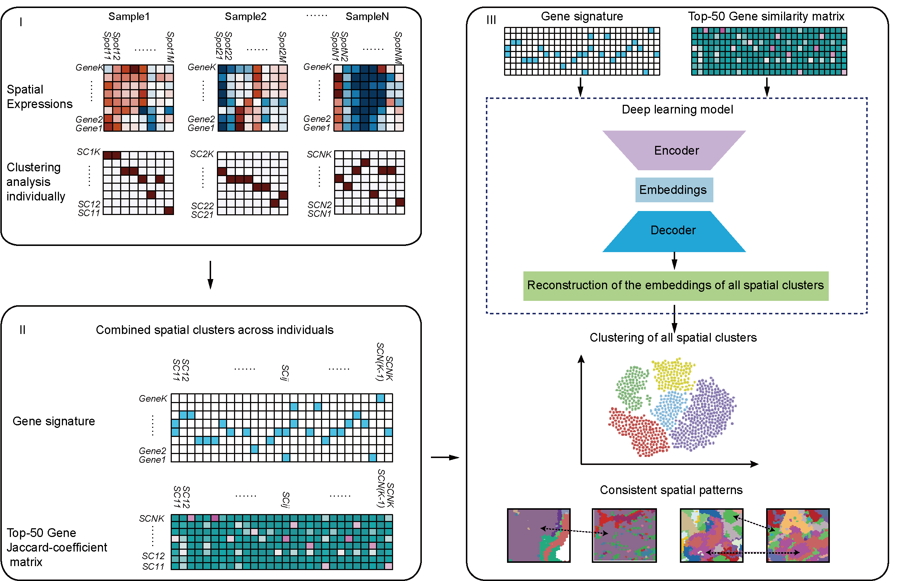

# SUMC (Spatially Unified Meta-Clustering)

### Chen Di
A computational framework for robust integration of multiple spatial transcriptomics datasets across platforms and batches.



## Overview

SUMC (Spatially Unified Meta-Clustering) is a deep learning-based framework that addresses the critical challenge of batch effects in cross-sample spatial transcriptomics analysis. It employs a three-stage clustering strategy to align spatial architectures and identify conserved spatial patterns across diverse datasets.

The framework integrates:

- 1. Spatial clustering using BayesSpace to identify local clusters within each sample

- 2. Cross-sample integration using a neural network that combines gene signatures with spatial similarities

- 3. Consensus meta-clustering to identify global meta-clusters across samples

## Pipeline Architecture
```text
ST Data list
    │
    ▼
prepareForSUMC.R (Step 1)
    ├── Per-sample spatial clustering (BayesSpace, K=10-50)
    ├── Marker gene identification 
    ├── Optimal K selection (max unique markers)
    ├── Cross-sample gene signature matrix
    ├── Spatial similarity matrix
    │
    ▼
sumc.py (Step 2)
    ├── Neural network training
    ├── Orthogonal constraint learning
    ├── Spatial consistency regularization
    ├── Embeddings generation
    │
    ▼
downStreamForSUMC.R (Step 3)
    ├── Consensus clustering
    ├── Silhouette analysis
    ├── Optimal meta-cluster selection
    ├── Meta-cluster assignment
```
## Installation

### Python Environment (SUMC Core)	
```bash
### Clone repository
git clone https://github.com/yourusername/SUMC.git
cd SUMC

### Create conda environment
conda create -n sumc python=3.9
conda activate sumc

### Install Python dependencies
conda install numpy pandas scikit-learn tqdm
pip install torch torchvision torchaudio
```
### R Environment (Preprocessing & Downstream)
```r
# Install required R packages
install.packages(c("BiocManager", "devtools"))
BiocManager::install(c("BayesSpace", "scater", "monocle3", "Seurat"))
install.packages(c("ggplot2", "pheatmap", "dplyr", "cluster", "ggpubr", 
                   "cowplot", "reshape2", "ConsensusClusterPlus"))
```
## Quick Start

### 1. Prepare Input Data

```r
# Prepare your ST data as a list of Seurat objects
st.objs <- readRDS("path/to/st_data.Rds")

# Run preprocessing to generate SUMC input files
source("prepareForSUMC.R")
# This will generate:
# - bestk_input_matrix_0.csv (gene signature matrix)
# - bestk_adj_matrix_0.csv (similarity matrix)
```

### 2. Run SUMC Embedding

### Input file format(generated by prepareForSUMC.R or other user-defined codes)

#### Gene Signature Matrix (signature_matrix.csv)

- Format: CSV file with row names

- Content: Binary matrix (0/1) indicating gene signatures

- Rows: Local clusters or samples

- Columns: Genes or features

- Example:
    
```csv
,Gene1,Gene2,Gene3
Sample1_Cluster1,1,0,1
Sample1_Cluster2,0,1,0
Sample1_Cluster3,1,1,0
......
SampleN_Cluster1,1,0,1
SampleN_Cluster2,0,1,0
SampleN_Cluster3,1,1,0
```
#### Similarity Matrix (adjacency_matrix.csv)

- Format: CSV file with row names

- Content: Similarity scores between 0 and 1

- Shape: Square matrix (n_clusters × n_clusters)

- Diagonal: Typically 1 (self-similarity)

- Example:

```csv
,Sample1_Cluster1,Sample1_Cluster2,Sample1_Cluster3
Sample1_Cluster1,1,0,1
Sample1_Cluster2,0,1,0
Sample1_Cluster3,1,1,0
......
SampleN_Cluster1,1,0,1
SampleN_Cluster2,0,1,0
SampleN_Cluster3,1,1,0
```
### Run SUMC
```bash
# Generate embeddings using SUMC neural network
python sumc.py \
    bestk_input_matrix_0.csv \
    bestk_adj_matrix_0.csv \
    -o SUMC_embeddings.csv \
    -n 1000 \
    --device cpu
```
### 3. Downstream Meta-Clustering	

```r
# Perform consensus clustering on embeddings
source("downStreamForSUMC.R")
# This will:
# - Perform consensus clustering (K=10-30)
# - Calculate silhouette scores
# - Select optimal K (e.g., 19)
# - Assign meta-clusters to original samples
```
## Input Data Requirements

### Required Data Structure:
```r
# List of Seurat objects with spatial information
st.objs <- list(
  sample1 = seurat_obj1,  # Must contain Spatial assay
  sample2 = seurat_obj2,
  ...
)

# Save as RDS for pipeline
saveRDS(st.objs, "st_obj_list.Rds")
```

## Performance Tips:

Pre-filter low-quality spots before analysis

Use parallel processing for marker gene identification

While BayesSpace is selected for the local clustering of per-sample ST, you can experiment with other algorithms like BANKSY or others, make sure you can generate the input files for sumc.py

## Example input files for sumc.py:

bestk_try10_input_matrix_0.csv is one example for "Gene Signature Matrix";
bestk_try10_adj_matrix_0.csv is one example for "Similarity Matrix"
